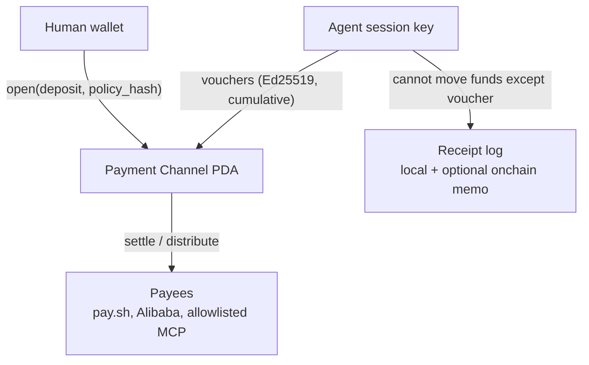

# Architecture

Keep the sprint on four objects: **channel**, **policy**, **session key**, **receipt**.

## Layering

| Layer | Whose job | Tab’s job |
| ----- | --------- | --------- |
| Settlement | Solana payment channels + x402 `upto` / MPP session | Open/settle/close; never invent a new payment protocol |
| Gateway | pay.sh, Foundation facilitators | Call them as allowlisted payees |
| Policy | Tab program or config account | Caps, allowlist, freeze; hash committed at `open` |
| Agent UX | Claude Code / OpenClaw / Cursor skill | Install, fund, show receipts, freeze |
| Custody of root | Human wallet (Phantom, keypair, later Swig) | Human signs `open` and freeze / close |

Do not build a facilitator. Do not build a merchant dashboard.

## What we reuse

- [solana-foundation/payment-channels](https://github.com/solana-foundation/payment-channels)
- [pay-kit](https://github.com/solana-foundation/pay-kit) / MPP SDK
- pay.sh for a live inference/API payee

## Trust model (honest)

MVP trust: the **channel program + policy program** are trusted. The agent runtime is not. A compromised agent can spend **up to the remaining ceiling, only to allowlisted payees**. That is the product.
